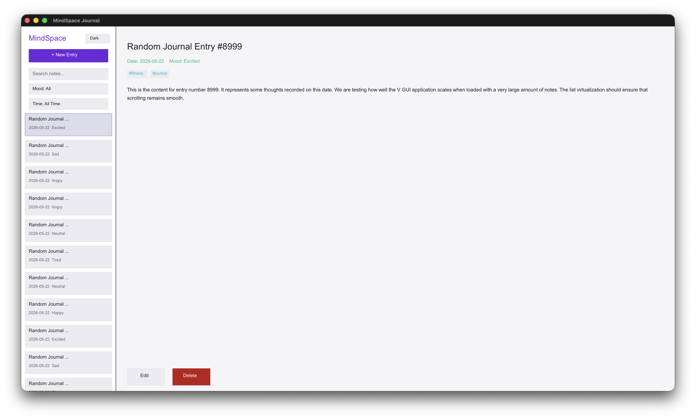
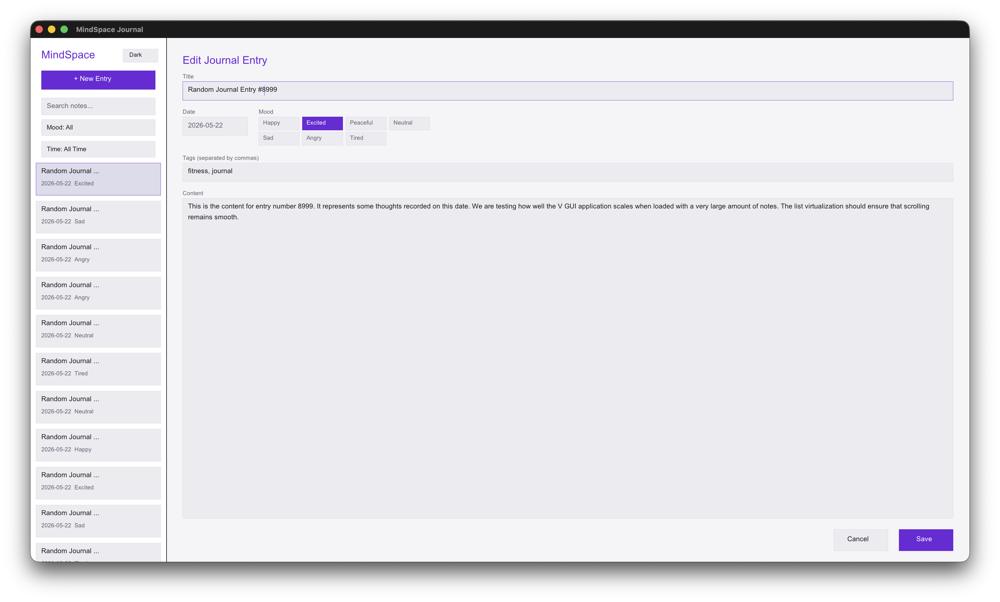
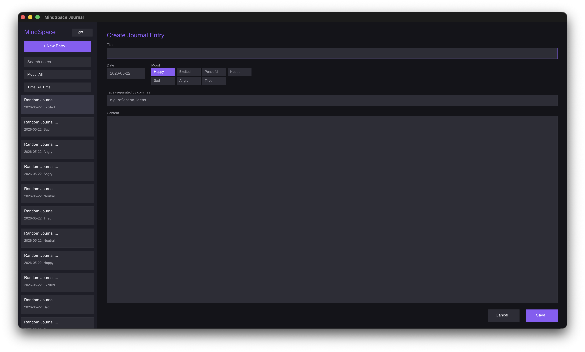

# 🌌 MindSpace Journal

A sleek, lightweight, local-first personal journaling application written in the **V Programming Language** (`vlang`), powered by the native `gg` graphics library. MindSpace provides a distraction-free space to record your thoughts, track your moods, and search through your memories, all while keeping your data entirely local and private.

---

## 📸 Application Screenshots





---

## ✨ Features

- **🔒 Local-First & Private:** Your entries are stored locally as standard JSON in `entries.json`. No external databases, no cloud synchronization, and absolute privacy.
- **🎨 Modern Custom UI:**
  - Built from scratch on a hardware-accelerated GUI canvas (`sokol` / `gg`).
  - Sleek typography utilizing native macOS system fonts.
  - Active hover states, micro-animations, and smooth scrolling for both the entry listing and main content.
- **🌗 Instant Theme Toggling:** Switch dynamically between a clean Light Mode and a deep, focused Dark Mode. Your theme preference and window dimensions are persisted automatically in `settings.json`.
- **📝 Interactive Form Editor:**
  - Custom text fields with cursor blinking, arrow key navigation, text selection inputs, and multi-line wrapping.
  - Dedicated **Mood Selector** (Happy, Excited, Peaceful, Neutral, Sad, Angry, Tired).
  - Comma-separated tag support to categorize your thoughts.
- **🔍 Advanced Search & Filtering:**
  - **Full-text search** matches titles, content, and tags in real-time.
  - **Mood filters** let you view entries matching specific emotions.
  - **Date filters** enable quick browsing (All Time, Today, This Week, This Month, This Year, or a custom `YYYY-MM-DD` date range).

---

## 🚀 Getting Started

### Prerequisites

1. **V Compiler:** Install the V compiler by following the instructions on [vlang.io](https://vlang.io) or via Homebrew on macOS:
   ```bash
   brew install vlang
   ```
2. **Build Tools:** Ensure you have macOS Command Line Tools installed:
   ```bash
   xcode-select --install
   ```

### Running the Application

To run the application directly from source code without creating a binary:
```bash
v run .
```

### Compiling to a Standalone Binary

You can compile the source code into a standalone binary executable using the following commands:

* **Development Build** (fast compilation, includes debug symbol info):
  ```bash
  v -o "MindSpace Journal" .
  ```

* **Production Release** (highly optimized, smaller binary size):
  ```bash
  v -prod -o "MindSpace Journal" .
  ```

This generates a standalone executable file named `MindSpace Journal` in the project root directory, which can be run directly:
```bash
./"MindSpace Journal"
```

---

## 📂 Project Structure

- `main.v` - The primary codebase containing state management, rendering loops, theme settings, event handling (mouse, scroll, keyboard), and local file I/O.
- `v.mod` - V module configuration and metadata.
- `entries.json` - Your local database (created automatically upon saving your first entry).
- `settings.json` - Saves user settings such as theme choice (dark/light) and last window dimensions.

---

## 📄 License

This project is licensed under the MIT License - see the [v.mod](v.mod) file for details.
